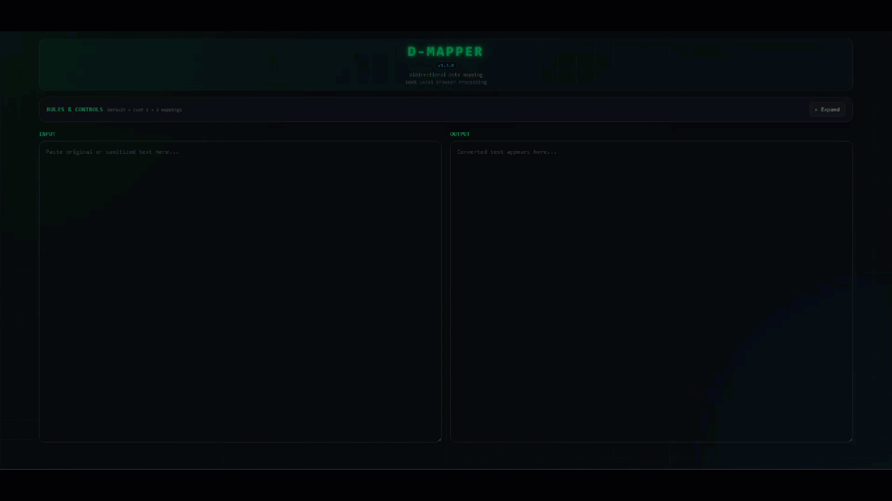

# D-MAPPER

**Bidirectional Data Mapping**

D-MAPPER is a standalone, client-side HTML utility for mapping values in both directions using:

- independently managed **Default Rules**;
- one selectable **Rule Set** at a time;
- per-rule enable/disable, regex, and case-sensitive matching;
- a global All Rules toggle;
- JSON import/export for Default Rules and selected rule sets;
- side-by-side INPUT and OUTPUT panes; and
- collapsible Rules & Controls.

All processing and saved state stay in the browser. The app has no server-side runtime requirement.

## Demo

The demo shows the core workflow: define mappings, convert **Real → Sanitized**, reverse them with **Sanitized → Real**, and temporarily disable all rules for passthrough. The example values are the built-in sample mappings.

## GitHub Pages

The repository root contains `index.html`, which is the GitHub Pages entry point. Keep this filename **unversioned** so the public Pages URL remains stable across releases.

Recommended release convention:

- Git tag: `v1.3.0`
- GitHub release title: `D-MAPPER v1.3.0`
- Pages entry point: `index.html`
- Optional downloadable release asset: `d-mapper-1.3.0.html`

To publish from the repository root, enable GitHub Pages for the repository and select the main branch/root as the Pages source (or use your preferred Pages deployment workflow).

## Versioning

D-MAPPER uses Semantic Versioning: `MAJOR.MINOR.PATCH`. The application version is declared in `index.html` and shown in the UI. Release tags are the authoritative release identifiers.

## Local use

Open `index.html` directly in a modern browser. No build step or dependencies are required.

## Privacy

D-MAPPER performs mapping locally in the browser. Rule data and UI state are stored with browser `localStorage`; imported JSON is read locally by browser APIs.

## License

D-MAPPER is released under the **MIT License**. See [`LICENSE`](LICENSE).

The MIT License permits commercial use, modification, distribution, and private use, provided the copyright and license notice are retained.
